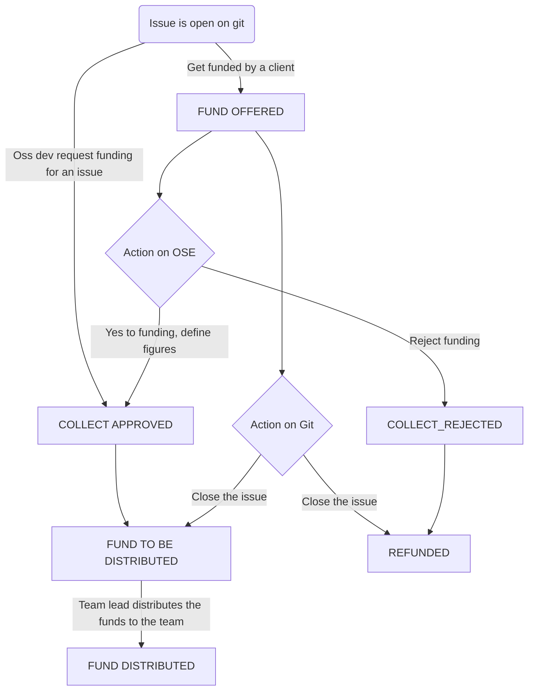

```mermaid
flowchart TD

    OPENED(Issue is open on git) -->|Get funded by a client| FundOffered[FUND OFFERED]

    OPENED(Issue is open on git) -->|Oss dev request funding for an issue| CollectApproved[FUND OFFERED]

    FundOffered --> ActionOnGit{Action on Git}
    FundOffered --> ActionOnOSE{Action on OSE}

    ActionOnOSE --> |Yes to funding, define figures| CollectApproved[COLLECT APPROVED]
    ActionOnOSE --> |Reject funding| CollectRejected[COLLECT_REJECTED]

    CollectApproved --> FundToBeDistributed[FUND TO BE DISTRIBUTED]
    ActionOnGit --> |Close the issue| FundToBeDistributed[FUND TO BE DISTRIBUTED]
    FundToBeDistributed --> |Team lead distributes the funds to the team|FundDistributed[FUND DISTRIBUTED]

    ActionOnGit --> |Close the issue| Refunded[REFUNDED]
    CollectRejected --> Refunded[REFUNDED]
```

NOTE: The fact that the collected funds match the requested amount is not a state. 
A developer can still address the issue and collect funding even if the requested amount is not met.